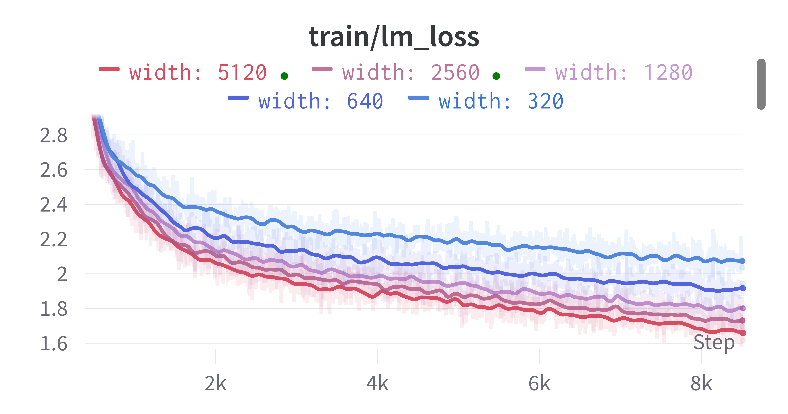

# How to use Mup (https://github.com/microsoft/mup)

## Add mup neox args to your config

```
# mup

"use-mup": true,

"save-base-shapes": false, # this only needs to be enabled once in order to generate the base-shapes-file on each rank

"base-shapes-file": "base-shapes", # load base shapes from this file

"coord-check": false, # generate coord check plots to verify mup's implementation in neox

# mup hp search

"mup-init-scale": 1.0,

"mup-attn-temp": 1.0,

"mup-output-temp": 1.0,

"mup-embedding-mult": 1.0,

"mup-rp-embedding-mult": 1.0,
```

## Install package

```
cd mup
pip install -e .
```

## Generate base shapes

1. Set use-mup to true
2. Set save-base-shapes to true
3. Run once. gpt-neox will instantiate a base model and a delta model, then save one file per rank named <base-shapes-file>.<rank>. gpt-neox will exit immediately.
4. Set save-base-shapes to false

## Testing the implementation

The most simple test is to use the coordinate check:
1. Keep use-mup true
2. Set coord-check to true
3. Run once. gpt-neox will output jpg images similar to those below and exit immediately
4. Set coord-check to false
What you are gonna get is some stastistics of pre-activations for models only differing by the width. If done correctly these should be approximately horizontal

<font size="1"> *Healthy coordinate check*</font> 

<font size="1"> *Something's wrong*</font> 

A second kind of test is to pick any configuration and learning rate (that doesn't lead to diverging training) and simply run a few different experiments fixing everything except for the width. Since with mup wider is always better the results should look like the figure below

<font size="1"> *Healthy training*</font> 

## Tune mup hyperparameters and LR

The values under `mup hp search` were added and correspond to appendix F.4 from https://arxiv.org/pdf/2203.03466.pdf. These and LR are tuned with a random search using the scaled-up config (tested with 6-7B.yml) but with hidden-size set to the value from the scaled-down config (125M.yml).

## Transfer

With the best LR set and the best mup HPs set, revert the value of hidden-size in the scaled-up config and run again.

## Usage under distributed setting

The code is setup so that each individual rank takes care of its own piece of model and dumps a different shape file to be picked up for training. The easiest way to do the right thing is to generate the base shapes with the same number of devices and same tensor/pipe parallelism that should be used later on. Consider also the following
- Data parallelism: nothing changes for mup, you can copy paste a base_shape N times for each data-parallel rank
- Pipe parallelism: still nothing changes but different ranks need to deal with different layers so check above
- **Tensor parallelism: has a huge effect on mup**. Column parallel layers get chopped on the input dimension changing the actual width of the parameter. Think carefully about what you are doing if you are not sticking to what's written above