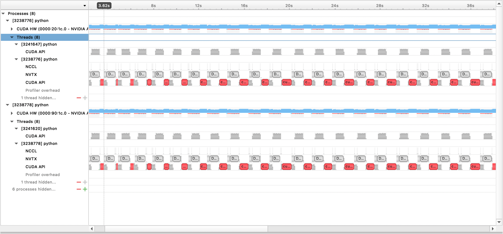
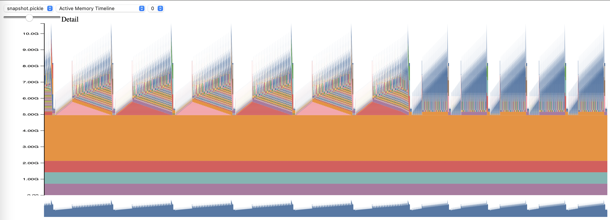

[](https://github.com/EleutherAI/gpt-neox/issues)
[](https://wandb.ai/eleutherai/neox)

# GPT-NeoX

This repository records [EleutherAI](https://www.eleuther.ai)'s library for training large-scale language models on GPUs. Our current framework is based on NVIDIA's [Megatron Language Model](https://github.com/NVIDIA/Megatron-LM) and has been augmented with techniques from [DeepSpeed](https://www.deepspeed.ai) as well as some novel optimizations. We aim to make this repo a centralized and accessible place to gather techniques for training large-scale autoregressive language models, and accelerate research into large-scale training. This library is in widespread use in [academic, industry, and government labs](https://github.com/EleutherAI/gpt-neox#adoption-and-publications), including by researchers at Oak Ridge National Lab, CarperAI, Stability AI, Together.ai, Korea University, Carnegie Mellon University, and the University of Tokyo among others. Uniquely among similar libraries GPT-NeoX supports a wide variety of systems and hardwares, including launching via Slurm, MPI, and the IBM Job Step Manager, and has been run at scale on [AWS](https://aws.amazon.com/), [CoreWeave](https://www.coreweave.com/), [ORNL Summit](https://www.olcf.ornl.gov/summit/), [ORNL Frontier](https://www.olcf.ornl.gov/frontier/),  [LUMI](https://www.lumi-supercomputer.eu/), and others.

**If you are not looking to train models with billions of parameters from scratch, this is likely the wrong library to use. For generic inference needs, we recommend you use the Hugging Face `transformers` library instead which supports GPT-NeoX models.**

## Why GPT-NeoX?

GPT-NeoX leverages many of the same features and technologies as the popular Megatron-DeepSpeed library but with substantially increased usability and novel optimizations. Major features include:
* Distributed training with ZeRO and 3D parallelism
* A wide variety of systems and hardwares, including launching via Slurm, MPI, and the IBM Job Step Manager, and has been run at scale on [AWS](https://aws.amazon.com/), [CoreWeave](https://www.coreweave.com/), Oak Ridge's [Summit](https://www.olcf.ornl.gov/summit/) and [Frontier](https://www.olcf.ornl.gov/frontier/),  [Pacific Northwest National Laboratory](https://hpc.pnl.gov/index.shtml), Argonne's [Polaris](https://docs.alcf.anl.gov/polaris/data-science-workflows/applications/gpt-neox/), [LUMI](https://www.lumi-supercomputer.eu/), and more.
* Cutting edge architectural innovations including rotary and alibi positional embeddings, parallel feedforward attention layers, and flash attention.
* Predefined configurations for popular architectures including Pythia, PaLM, Falcon, and LLaMA 1 \& 2
* Curriculum Learning
* Easy connections with the open source ecosystem, including Hugging Face's [tokenizers](https://github.com/huggingface/tokenizers) and [transformers](https://github.com/huggingface/transformers/) libraries, logging via [WandB](https://wandb.ai/site), and evaluation via our [Language Model Evaluation Harness](https://github.com/EleutherAI/lm-evaluation-harness).

## News
**[8/10/2023]** We now support checkpointing with AWS S3! Activate with the `s3_path` config option (for more detail, see [the PR](https://github.com/EleutherAI/gpt-neox/pull/1010))

**[9/20/2023]** As of https://github.com/EleutherAI/gpt-neox/pull/1035, we have deprecated Flash Attention 0.x and 1.x, and migrated support to Flash Attention 2.x. We don't believe this will cause problems, but if you have a specific use-case that requires old flash support using the latest GPT-NeoX, please raise an issue.

**[8/10/2023]** We have experimental support for LLaMA 2 and Flash Attention v2 supported in our [math-lm](https://github.com/EleutherAI/math-lm) project that will be upstreamed later this month.

**[5/17/2023]** After fixing some miscellaneous bugs we now fully support bf16.

**[4/11/2023]** We have upgraded our Flash Attention implementation to now support Alibi positional embeddings.

**[3/9/2023]** We have released GPT-NeoX 2.0.0, an upgraded version built on the latest DeepSpeed which will be regularly synced with going forward.

## Versions

Prior to 3/9/2023, GPT-NeoX relied on [DeeperSpeed](https://github.com/EleutherAI/DeeperSpeed), which was based on an old version of DeepSpeed (0.3.15). In order to migrate to the latest upstream DeepSpeed version while allowing users to access the old versions of GPT-NeoX and DeeperSpeed, we have introduced two versioned releases for both libraries:

- Version 2.0 of [GPT-NeoX](https://github.com/EleutherAI/gpt-neox/releases/tag/v2.0) and [DeeperSpeed](https://github.com/EleutherAI/DeeperSpeed/releases/tag/v2.0) are the latest versions built on the latest DeepSpeed, and will be maintained going forward.
- Version 1.0 of [GPT-NeoX](https://github.com/EleutherAI/gpt-neox/releases/tag/v1.0) and [DeeperSpeed](https://github.com/EleutherAI/DeeperSpeed/releases/tag/v1.0) maintain snapshots of the old stable versions that [GPT-NeoX-20B](https://arxiv.org/abs/2204.06745) and the [Pythia Suite](https://github.com/EleutherAI/pythia) were trained on.

# Contents

- [GPT-NeoX](#gpt-neox)
  * [Why GPT-NeoX?](#why-gpt-neox)
  * [News](#news)
  * [Versions](#versions)
- [Contents](#contents)
- [Quick Start](#quick-start)
  * [Environment and Dependencies](#environment-and-dependencies)
    + [Host Setup](#host-setup)
    + [Flash Attention](#flash-attention)
    + [Multi-Node Launching](#multi-node-launching)
    + [Containerized Setup](#containerized-setup)
  * [Usage](#usage)
- [Configuration](#configuration)
    * [Mixture of Experts](#mixture-of-experts)
- [Datasets](#datasets)
  * [Preconfigured Datasets](#preconfigured-datasets)
  * [Using Custom Data](#using-custom-data)
- [Training and Finetuning](#training-and-finetuning)
  * [Pretrained Models](#pretrained-models)
    + [GPT-NeoX-20B](#gpt-neox-20b)
    + [Pythia](#pythia)
    + [Polyglot](#polyglot)
- [Inference](#inference)
- [Evaluation](#evaluation)
- [Exporting to Hugging Face](#exporting-to-hugging-face)
- [Monitoring](#monitoring)
  * [Weights and Biases](#weights-and-biases)
  * [TensorBoard](#tensorboard)
- [Running on multi-node](#running-on-multi-node)
- [Profiling](#profiling)
- [Adoption and Publications](#adoption-and-publications)
  * [Publications](#publications)
  * [Models](#models)
    + [English LLMs](#english-llms)
    + [Non-English LLMs](#non-english-llms)
    + [Code Models](#code-models)
    + [Other Modalities](#other-modalities)
- [Administrative Notes](#administrative-notes)
  * [Citing GPT-NeoX](#citing-gpt-neox)
  * [Contributing](#contributing)
  * [Licensing](#licensing)
  * [Acknowledgements](#acknowledgements)

# Quick Start

## Environment and Dependencies

### Host Setup

First make sure you are in an environment with Python 3.8 with an appropriate version of PyTorch 1.8 or later installed. **Note:** Some of the libraries that GPT-NeoX depends on have not been updated to be compatible with Python 3.10+. Python 3.9 appears to work, but this codebase has been developed and tested for Python 3.8.

To install the remaining basic dependencies, run:

```bash
pip install -r requirements/requirements.txt
pip install -r requirements/requirements-wandb.txt # optional, if logging using WandB
pip install -r requirements/requirements-tensorboard.txt # optional, if logging via tensorboard
python ./megatron/fused_kernels/setup.py install # optional, if using fused kernels
```

from the repository root.

> [!Warning]
> Our codebase relies on [DeeperSpeed](https://github.com/EleutherAI/DeeperSpeed), our fork of the [DeepSpeed](https://github.com/microsoft/DeepSpeed) library with some added changes. We strongly recommend using Anaconda, a virtual machine, or some other form of environment isolation before continuing. Failure to do so may cause other repositories that rely on DeepSpeed to break.

</aside>

### Flash Attention

To use [Flash-Attention](https://github.com/HazyResearch/flash-attention), install the additional dependencies in  `./requirements/requirements-flashattention.txt` and set the attention type in your configuration accordingly (see [configs](./configs/)). This can provide significant speed-ups over regular attention on certain GPU architectures, including Ampere GPUs (such as A100s); see the repository for more details.


### Multi-Node Launching

NeoX and Deep(er)Speed support training on multiple different nodes and you have the option of using a variety of different launchers to orchestrate multi-node jobs.

In general there needs to be a "hostfile" somewhere accessible with the format:

```bash
node1_ip slots=8
node2_ip slots=8
```

where the first column contains the IP address for each node in your setup and the number of slots is the number of GPUs that node has access to. In your config you must pass in the path to the hostfile with `"hostfile": "/path/to/hostfile"`. Alternatively the path to the hostfile can be in the environment variable `DLTS_HOSTFILE`.

#### pdsh

`pdsh` is the default launcher, and if you're using `pdsh` then all you must do (besides ensuring that pdsh is installed in your environment) is set `{"launcher": "pdsh"}` in your config files.

#### MPI

If using MPI then you must specify the MPI library (DeepSpeed/GPT-NeoX currently supports `mvapich`, `openmpi`, `mpich`, and `impi`, though `openmpi` is the most commonly used and tested) as well as pass the `deepspeed_mpi` flag in your config file:

```json
{
    "launcher": "openmpi",
    "deepspeed_mpi": true
}
```

With your environment properly set up and the correct configuration files you can use `deepy.py` like a normal python script and start (for example) a training job with:

`python3 deepy.py train.py /path/to/configs/my_model.yml`

#### Slurm

Using Slurm can be slightly more involved. Like with MPI, you must add the following to your config:

```json
{
    "launcher": "slurm",
    "deepspeed_slurm": true
}
```
If you do not have ssh access to the compute nodes in your Slurm cluster you need to add `{"no_ssh_check": true}`

#### (Advanced) Custom Launching

There are many cases where the above default launching options are not sufficient

- Many clusters have their own unique job scheduler or specific MPI/Slurm arguments necessary for launching jobs such as [Summit JSRun](https://docs.olcf.ornl.gov/systems/summit_user_guide.html#job-launcher-jsrun) or [LLNL Flux](https://computing.llnl.gov/projects/flux-building-framework-resource-management)
- While the above Slurm/MPI/pdsh default options are enough for most job runs, advanced users may want to add arguments for optimization or debugging purposes

In these cases, you will need to modify the DeepSpeed [multinode runner](https://github.com/microsoft/DeepSpeed/blob/17957728c0362bf8ae70feca308e491e55ef9feb/deepspeed/launcher/multinode_runner.py) utility to support your usecase. Broadly, these enhancements fall under two categories:

##### 1. Adding a Launcher (e.g. [JSRun](https://docs.olcf.ornl.gov/systems/summit_user_guide.html#job-launcher-jsrun), [Flux](https://computing.llnl.gov/projects/flux-building-framework-resource-management), etc)

In this case, you must add a new multinode runner class to `deepspeed/launcher/multinode_runner.py` and expose it as a configuration option in GPT-NeoX. Examples on how we did this for [Summit JSRun](https://docs.olcf.ornl.gov/systems/summit_user_guide.html#job-launcher-jsrun) are in [this DeeperSpeed commit](https://github.com/EleutherAI/DeeperSpeed/commit/9aed6c8500d7c492d85c5c88687322dbda70e370) and [this GPT-NeoX commit](https://github.com/EleutherAI/gpt-neox/commit/3782c7ae60f8624e566e3879b89bb09e8b59b869), respectively.

##### 2. Modifying Run Command or Environment Variables

We have encountered many cases where we wish to modify the MPI/Slurm run command for an optimization or to debug (e.g. to modify the [Slurm srun CPU binding](https://slurm.schedmd.com/srun.html#OPT_cpu-bind) or to tag MPI logs with the rank). In this case, you must modify the multinode runner class' run command under its `get_cmd` method (e.g. [mpirun_cmd](https://github.com/microsoft/DeepSpeed/blob/17957728c0362bf8ae70feca308e491e55ef9feb/deepspeed/launcher/multinode_runner.py#L135-L147) for OpenMPI). Examples on how we did this to provide optimized and rank-tagged run commands using Slurm and OpenMPI for the Stability cluster are in [this DeeperSpeed branch](https://github.com/microsoft/DeepSpeed/compare/master...EleutherAI:DeeperSpeed:v2.0-stability)


#### Hostfile Generation

In general you will not be able to have a single fixed hostfile, so you need to have a script to generate one dynamically when your job starts. An example script to dynamically generate a hostfile using [Slurm](https://slurm.schedmd.com/documentation.html) and 8 GPUs per node is:

```bash
#!/bin/bash
GPUS_PER_NODE=8
mkdir -p /sample/path/to/hostfiles
# need to add the current slurm jobid to hostfile name so that we don't add to previous hostfile
hostfile=/sample/path/to/hostfiles/hosts_$SLURM_JOBID
# be extra sure we aren't appending to a previous hostfile
rm $hostfile &> /dev/null
# loop over the node names
for i in `scontrol show hostnames $SLURM_NODELIST`
do
    # add a line to the hostfile
    echo $i slots=$GPUS_PER_NODE >>$hostfile
done
```

`$SLURM_JOBID` and `$SLURM_NODELIST` being environment variables Slurm will create for you. See the [sbatch documentation](https://slurm.schedmd.com/sbatch.html#SECTION_OUTPUT-ENVIRONMENT-VARIABLES) for a full list of available Slurm environment variables set at job creation time.

#### Job Launching

Then you can create an [sbatch](https://slurm.schedmd.com/sbatch.html) script from which to kick off your GPT-NeoX job. A bare-bones sbatch script on a Slurm-based cluster with 8 GPUs per node would look like this:

```bash
#!/bin/bash
#SBATCH --job-name="neox"
#SBATCH --partition=your-partition
#SBATCH --nodes=1
#SBATCH --ntasks-per-node=8
#SBATCH --gres=gpu:8

# Some potentially useful distributed environment variables
export HOSTNAMES=`scontrol show hostnames "$SLURM_JOB_NODELIST"`
export MASTER_ADDR=$(scontrol show hostnames "$SLURM_JOB_NODELIST" | head -n 1)
export MASTER_PORT=12802
export COUNT_NODE=`scontrol show hostnames "$SLURM_JOB_NODELIST" | wc -l`

# Your hostfile creation script from above
./write_hostfile.sh
# Tell DeepSpeed where to find our generated hostfile via DLTS_HOSTFILE
export DLTS_HOSTFILE=/sample/path/to/hostfiles/hosts_$SLURM_JOBID

# Launch training
python3 deepy.py train.py /sample/path/to/your/configs/my_model.yml

```

You can then kick off a training run with `sbatch my_sbatch_script.sh`


### Containerized Setup

We also provide a Dockerfile and docker-compose configuration if you prefer to run NeoX in a container.

Requirements to run the container are to have appropriate GPU drivers, an up-to-date installation of Docker, and [nvidia-container-toolkit](https://docs.nvidia.com/datacenter/cloud-native/container-toolkit/latest/install-guide.html) installed. To test if your installation is good you can use their "sample workload", which is:

```
docker run --rm --runtime=nvidia --gpus all ubuntu nvidia-smi
```

Provided that will run, you need to export NEOX_DATA_PATH and NEOX_CHECKPOINT_PATH in your environment to specify your data directory and directory for storing and loading checkpoints:

```
export NEOX_DATA_PATH=/mnt/sda/data/enwiki8 #or wherever your data is stored on your system
export NEOX_CHECKPOINT_PATH=/mnt/sda/checkpoints
```

And then, from the gpt-neox directory, you can build the image and run a shell in a container with

```
docker compose run gpt-neox bash
```

After the build, you should be able to do this:
```
mchorse@537851ed67de:~$ echo $(pwd)
/home/mchorse
mchorse@537851ed67de:~$ ls -al
total 48
drwxr-xr-x  1 mchorse mchorse 4096 Jan  8 05:33 .
drwxr-xr-x  1 root    root    4096 Jan  8 04:09 ..
-rw-r--r--  1 mchorse mchorse  220 Feb 25  2020 .bash_logout
-rw-r--r--  1 mchorse mchorse 3972 Jan  8 04:09 .bashrc
drwxr-xr-x  4 mchorse mchorse 4096 Jan  8 05:35 .cache
drwx------  3 mchorse mchorse 4096 Jan  8 05:33 .nv
-rw-r--r--  1 mchorse mchorse  807 Feb 25  2020 .profile
drwxr-xr-x  2 root    root    4096 Jan  8 04:09 .ssh
drwxrwxr-x  8 mchorse mchorse 4096 Jan  8 05:35 chk
drwxrwxrwx  6 root    root    4096 Jan  7 17:02 data
drwxr-xr-x 11 mchorse mchorse 4096 Jan  8 03:52 gpt-neox
```

For a long-running job, you should run

```
docker compose up -d
```

to run the container in detached mode, and then, in a separate terminal session, run

```
docker compose exec gpt-neox bash
```

You can then run any job you want from inside the container.

Concerns when running for a long time or in detached mode include
 - You will have to terminate the container manually when you are no longer using it
 - If you want processes to continue running when your shell session ends, you will need to background them.
 - If you then want logging, you will have to make sure to pipe logs to disk or set up wandb.

If you prefer to run the prebuilt container image from dockerhub, you can run the docker compose commands with ```-f docker-compose-dockerhub.yml``` instead, e.g.,

```
docker compose run -f docker-compose-dockerhub.yml gpt-neox bash
```

## Usage

All functionality should be launched using `deepy.py`, a wrapper around the `deepspeed` launcher.

We currently offer three main functions:
1. `train.py` is used for training and finetuning models.
2. `eval.py` is used to evaluate a trained model using the [language model evaluation harness](https://github.com/EleutherAI/lm-evaluation-harness).
3. `generate.py` is used to sample text from a trained model.

which can be launched with:

```bash
./deepy.py [script.py] [./path/to/config_1.yml] [./path/to/config_2.yml] ... [./path/to/config_n.yml]
```

For example, to launch training you can run
```bash
./deepy.py train.py ./configs/20B.yml ./configs/local_cluster.yml
```

For more details on each entry point, see the [Training and Finetuning](#training-and-finetuning), [Inference](#inference) and [Evaluation](#evaluation) respectively.

# Configuration

GPT-NeoX parameters are defined in a YAML configuration file which is passed to the deepy.py launcher. We have provided some example .yml files in [configs](./configs/), showing a diverse array of features and model sizes.

These files are generally complete, but non-optimal. For example, depending on your specific GPU configuration, you may need to change some settings such as `pipe-parallel-size`, `model-parallel-size` to increase or decrease the degree of parallelisation, `train_micro_batch_size_per_gpu` or `gradient-accumulation-steps` to modify batch size related settings, or the `zero_optimization` dict to modify how optimizer states are parallelised across workers.

For a more detailed guide to the features available and how to configure them, see [the configuration README](configs/README.md), and for documentation of every possible argument, see [configs/neox_arguments.md](configs/neox_arguments.md).

## Mixture of Experts

GPT-NeoX includes multiple expert implementations for MoE. To select between them, specify `moe_type` of `megablocks` (default) or `deepspeed`.

Both are based on the DeepSpeed MoE parallelism framework, which supports tensor-expert-data parallelism.
Both allow you to toggle between token-dropping and dropless (default, and this is what Megablocks was designed for).
Sinkhorn routing to come soon!

For an example of a basic complete configuration, see configs/125M-dmoe.yml (for Megablocks dropless) or configs/125M-moe.yml.

Most MoE related configuration arguments are prefixed with `moe`. Some common configuration parameters and their defaults are as follows:

```
moe_type: megablocks
moe_num_experts: 1 # 1 disables MoE. 8 is a reasonable value.
moe_loss_coeff: 0.1
expert_interval: 2 # See details below
enable_expert_tensor_parallelism: false # See details below
moe_expert_parallel_size: 1 # See details below
moe_token_dropping: false
```

DeepSpeed can be further configured with the following:

```
moe_top_k: 1
moe_min_capacity: 4
moe_train_capacity_factor: 1.0 # Setting to 1.0
moe_eval_capacity_factor: 1.0 # Setting to 1.0
```

One MoE layer is present every `expert_interval` transformer layers including the first, so with 12 layers total:

```
0, 1, 2, 3, 4, 5, 6, 7, 8, 9, 10, 11
```

Experts would be in these layers:

```
0, 2, 4, 6, 8, 10
```

By default, we use expert-data parallelism, so any available tensor parallelism (`model_parallel_size`) will be used for expert routing. For instance, given the following:

```
expert_parallel_size: 4
model_parallel_size: 2 # aka tensor parallelism
```

With 32 GPUs, the behavior will be look like:

- In non-expert layers:
  - Tensor parallelism is 2. (There are 32 / 2 = 16 such tensor parallel groups, each of size 2.)
  - Data parallelism implicitly becomes 32 / 2 = 16.
- In expert layers:
  - There is no tensor parallelism.
  - Expert parallelism is 4. (There are 32 / 4 = 8 expert parallel groups, each of size 4.)
  - Data parallelism implicitly becomes 32 / 4 = 8.  Some cross-node token routing happens as a result of this redivision of data parallelism between 16 and 8.  To avoid it, ensure that `expert_parallel_size == model_parallel_size`.

Setting `enable_expert_tensor_parallelism` enables tensor-expert-data (TED) parallelism. The way to interpret the above would then be:

- In non-expert layers: same as before.
- In expert layers:
  - Tensor parallelism is 2. (There are 32 / 2 = 16 tensor parallel groups, each of size 2.)
  - Expert parallelism is 4. (There are 32 / 4 = 8 expert parallel groups, each of size 4.)
  - Data parallelism implicitly becomes 32 / (2 * 4) = 4.  Again, cross-node token routing happens.  To avoid, ensure `expert_parallel_size == 1` or `model_parallel_size == 1`.

So note that DP must be divisible by (MP * EP).  For more details, see the [TED paper].

Pipeline parallelism is not yet supported - coming soon!

[TED paper]: https://arxiv.org/abs/2303.06318

# Datasets

## Preconfigured Datasets

Several preconfigured datasets are available, including most components from [the Pile](https://arxiv.org/abs/2101.00027), as well as the Pile train set itself, for straightforward tokenization using the `prepare_data.py` entry point.

E.G, to download and tokenize the enwik8 dataset with the GPT2 Tokenizer, saving them to `./data` you can run:

```
python prepare_data.py -d ./data
```

or a single shard of the pile (`pile_subset`) with the GPT-NeoX-20B tokenizer (assuming you have it saved at `./20B_checkpoints/20B_tokenizer.json`):

```
python prepare_data.py -d ./data -t HFTokenizer --vocab-file ./20B_checkpoints/20B_tokenizer.json pile_subset
```

The tokenized data will be saved out to two files: `[data-dir]/[dataset-name]/[dataset-name]_text_document.bin`and `[data-dir]/[dataset-name]/[dataset-name]_text_document.idx`. You will need to add the prefix that both these files share to your training configuration file under the `data-path` field. E.G:

```yaml
  "data-path": "./data/enwik8/enwik8_text_document",
```

## Using Custom Data

To prepare your own dataset for training with custom data, format it as one large [jsonl](https://jsonlines.org/)-formatted file with each item in the list of dictionaries being a separate document. The document text should be grouped under one JSON key, i.e `"text"`. Any auxiliary data stored in other fields will not be used.

Next make sure to download the GPT2 tokenizer vocab, and merge files from the following links:

- Vocab: https://s3.amazonaws.com/models.huggingface.co/bert/gpt2-vocab.json
- Merge: https://s3.amazonaws.com/models.huggingface.co/bert/gpt2-merges.txt

Or use the 20B tokenizer (for which only a single Vocab file is needed):

- Vocab: https://the-eye.eu/public/AI/models/GPT-NeoX-20B/slim_weights/20B_tokenizer.json

(alternatively, you can provide any tokenizer file that can be loaded by Hugging Face's tokenizers library with the `Tokenizer.from_pretrained()` command)

You can now pretokenize your data using `tools/datasets/preprocess_data.py`, the arguments for which are detailed below:

```
usage: preprocess_data.py [-h] --input INPUT [--jsonl-keys JSONL_KEYS [JSONL_KEYS ...]] [--num-docs NUM_DOCS] --tokenizer-type {HFGPT2Tokenizer,HFTokenizer,GPT2BPETokenizer,CharLevelTokenizer} [--vocab-file VOCAB_FILE] [--merge-file MERGE_FILE] [--append-eod] [--ftfy] --output-prefix OUTPUT_PREFIX
                          [--dataset-impl {lazy,cached,mmap}] [--workers WORKERS] [--log-interval LOG_INTERVAL]

optional arguments:
  -h, --help            show this help message and exit

input data:
  --input INPUT         Path to input jsonl files or lmd archive(s) - if using multiple archives, put them in a comma separated list
  --jsonl-keys JSONL_KEYS [JSONL_KEYS ...]
                        space separate listed of keys to extract from jsonl. Default: text
  --num-docs NUM_DOCS   Optional: Number of documents in the input data (if known) for an accurate progress bar.

tokenizer:
  --tokenizer-type {HFGPT2Tokenizer,HFTokenizer,GPT2BPETokenizer,CharLevelTokenizer}
                        What type of tokenizer to use.
  --vocab-file VOCAB_FILE
                        Path to the vocab file
  --merge-file MERGE_FILE
                        Path to the BPE merge file (if necessary).
  --append-eod          Append an <eod> token to the end of a document.
  --ftfy                Use ftfy to clean text

output data:
  --output-prefix OUTPUT_PREFIX
                        Path to binary output file without suffix
  --dataset-impl {lazy,cached,mmap}
                        Dataset implementation to use. Default: mmap

runtime:
  --workers WORKERS     Number of worker processes to launch
  --log-interval LOG_INTERVAL
                        Interval between progress updates

```

For example:

```bash
python tools/datasets/preprocess_data.py \
            --input ./data/mydataset.jsonl.zst \
            --output-prefix ./data/mydataset \
            --vocab ./data/gpt2-vocab.json \
            --merge-file gpt2-merges.txt \
            --dataset-impl mmap \
            --tokenizer-type GPT2BPETokenizer \
            --append-eod
```

You would then run training with the following settings added to your configuration file:

```yaml
  "data-path": "data/mydataset_text_document",
```

# Training and Finetuning

Training is launched using `deepy.py`, a wrapper around DeepSpeed's launcher, which launches the same script in parallel across many GPUs / nodes.

The general usage pattern is:

```bash
python ./deepy.py train.py [path/to/config1.yml] [path/to/config2.yml] ...
```

You can pass in an arbitrary number of configs which will all be merged at runtime.

You can also optionally pass in a config prefix, which will assume all your configs are in the same folder and append that prefix to their path.

E.G:

```bash
python ./deepy.py train.py -d configs 125M.yml local_setup.yml
```

This will deploy the `train.py` script on all nodes with one process per GPU. The worker nodes and number of GPUs are specified in the `/job/hostfile` file (see [parameter documentation](configs/README.md)), or can simply be passed in as the `num_gpus` arg if running on a single node setup.

Although this is not strictly necessary, we find it useful to define the model parameters in one config file (e.g `configs/125M.yml`) and the data path parameters in another (e.g `configs/local_setup.yml`).


## Pretrained Models

### GPT-NeoX-20B

GPT-NeoX-20B is a 20 billion parameter autoregressive language model trained on [the Pile](https://arxiv.org/abs/2101.00027). Technical details about GPT-NeoX-20B can be found in [the associated paper](https://arxiv.org/abs/2204.06745). The configuration file for this model is both available at [`./configs/20B.yml`](./configs/20B.yml) and included in the download links below.

[Slim weights](https://the-eye.eu/public/AI/models/GPT-NeoX-20B/slim_weights/) - (No optimizer states, for inference or finetuning, 39GB)

To download from the command line to a folder named `20B_checkpoints`, use the following command:

```bash
wget --cut-dirs=5 -nH -r --no-parent --reject "index.html*" https://the-eye.eu/public/AI/models/GPT-NeoX-20B/slim_weights/ -P 20B_checkpoints
```

[Full weights](https://the-eye.eu/public/AI/models/GPT-NeoX-20B/full_weights/) - (Including optimizer states, 268GB)

To download from the command line to a folder named `20B_checkpoints`, use the following command:

```bash
wget --cut-dirs=5 -nH -r --no-parent --reject "index.html*" https://the-eye.eu/public/AI/models/GPT-NeoX-20B/full_weights/ -P 20B_checkpoints
```

Weights can be alternatively be downloaded using a BitTorrent client. Torrent files can be downloaded here: [slim weights](https://the-eye.eu/public/AI/models/GPT-NeoX-20B/slim_weights.torrent), [full weights](https://the-eye.eu/public/AI/models/GPT-NeoX-20B/full_weights.torrent).

We additionally have 150 checkpoints saved throughout training, one every 1,000 steps. We are working on figuring out how to best serve these at scale, but in the meanwhile people interested in working with the partially trained checkpoints can email us at contact@eleuther.ai to arrange access.

### Pythia

The Pythia Scaling Suite is a suite of models ranging from 70M parameters to 12B parameters trained on [the Pile](https://pile.eleuther.ai) intended to promote research on interpretability and training dynamics of large language models. Further details about the project and links to the models can be found in the [in the paper](https://arxiv.org/abs/2304.01373) and [on the project's GitHub](https://github.com/EleutherAI/pythia).

### Polyglot

The Polyglot Project is an effort to train powerful non-English pretrained language models to promote the accessibility of this technology to researchers outside the dominant powerhouses of machine learning. EleutherAI has trained and released 1.3B, 3.8B, and 5.8B parameter Korean language models, the largest of which outpreforms all other publicly available language models on Korean language tasks. Further details about the project and links to the models can be found [here](https://github.com/EleutherAI/polyglot).

# Inference

**For most uses we recommend deploying models trained using the GPT-NeoX library via the Hugging Face Transformers library which is better optimized for inference.**

We support three types of generation from a pretrained model:
1. Unconditional generation
2. Conditional generation based on an input read from a file
3. Interactive generation, which allows for multiple rounds of back-and-forth between a user and the language model via a command line interface

All three types of text generation can be launched via `python ./deepy.py generate.py -d configs 125M.yml local_setup.yml text_generation.yml` with the appropriate values set in `configs/text_generation.yml`.

# Evaluation

GPT-NeoX supports evaluation on downstream tasks through the [language model evaluation harness](https://github.com/EleutherAI/lm-evaluation-harness).

To evaluate a trained model on the evaluation harness, simply run:

```bash
python ./deepy.py eval.py -d configs your_configs.yml --eval_tasks task1 task2 ... taskn
```

where `--eval_tasks` is a list of evaluation tasks followed by spaces, e.g `--eval_tasks lambada hellaswag piqa sciq`. For details of all tasks available, refer to the [lm-evaluation-harness repo](https://github.com/EleutherAI/lm-evaluation-harness).

# Exporting to Hugging Face

GPT-NeoX is optimized heavily for training only, and GPT-NeoX model checkpoints are not compatible out of the box with other deep learning libraries. To make models easily loadable and shareable with end users, and for further exporting to various other frameworks, GPT-NeoX supports checkpoint conversion to the [Hugging Face Transformers](https://arxiv.org/abs/1910.03771) format.

Though NeoX supports a number of different architectural configurations, including AliBi positional embeddings, not all of these configurations map cleanly onto the supported configurations within Hugging Face Transformers.

NeoX supports export of compatible models into the following architectures:
- GPTNeoXForCausalLM
- LlamaForCausalLM
- MistralForCausalLM

Training a model which does not fit into one of these Hugging Face Transformers architectures cleanly will require writing custom modeling code for the exported model.

To convert a GPT-NeoX library checkpoint to Hugging Face-loadable format, run:
```bash
python ./tools/ckpts/convert_neox_to_hf.py --input_dir /path/to/model/global_stepXXX --config_file your_config.yml --output_dir hf_model/save/location --precision {auto,fp16,bf16,fp32} --architecture {neox,mistral,llama}
```

Then to upload a model to [the Hugging Face Hub](https://huggingface.co/), run:
```bash
huggingface-cli login
python ./tools/ckpts/upload.py
```
and input the requested information, including HF hub user token.

### Importing Models Into GPT-NeoX

NeoX supplies several utilities for converting a pretrained model checkpoint into a format that can be trained within the library.

The following models or model families can be loaded in GPT-NeoX:
- Llama 1
- Llama 2
- CodeLlama
- Mistral-7b-v0.1

We provide two utilities for converting from two different checkpoint formats into a format compatible with GPT-NeoX.

To convert a Llama 1 or Llama 2 checkpoint distributed by Meta AI from its original file format (downloadable [here](https://github.com/facebookresearch/llama) or [here](https://huggingface.co/meta-llama/Llama-2-7b)) into the GPT-NeoX library, run

```
python tools/ckpts/convert_raw_llama_weights_to_neox.py --input_dir /path/to/model/parent/dir/7B --model_size 7B --output_dir /path/to/save/ckpt --num_output_shards <TENSOR_PARALLEL_SIZE> (--pipeline_parallel if pipeline-parallel-size >= 1)
```


To convert from a Hugging Face model into a NeoX-loadable, run `tools/ckpts/convert_hf_to_sequential.py`. See documentation within that file for further options.


# Monitoring

In addition to storing logs locally, we provide built-in support for two popular experiment monitoring frameworks: [Weights & Biases](https://wandb.ai/site) and [TensorBoard](https://www.tensorflow.org/tensorboard/)

## Weights and Biases

EleutherAI is currently using [Weights & Biases to record our experiments](https://wandb.ai/eleutherai/neox). If you are logged into Weights & Biases on your machine&mdash;you can do this by executing `wandb login`&mdash;your runs will automatically be recorded. There are two optional fields associated with Weights & Biases: <code><var>wandb_group</var></code> allows you to name the run group and <code><var>wandb_team</var></code> allows you to assign your runs to an organization or team account.

## TensorBoard

We also support using TensorBoard via the <code><var>tensorboard-dir</var></code> field. Dependencies required for TensorBoard monitoring can be found in and installed from  `./requirements/requirements-tensorboard.txt`.

# Running on multi-node

If you need to supply a hostfile for use with the MPI-based DeepSpeed launcher, you can set the environment variable `DLTS_HOSTFILE` to point to the hostfile.

# Profiling

We support profiling with Nsight Systems and PyTorch Memory Profiling.

## Nsight Systems Profiling

To use the Nsight Systems profiling, set config options `profile`, `profile_step_start`, and `profile_step_stop`. Launch training with:

```
nsys profile -s none -t nvtx,cuda -o <path/to/profiling/output> --force-overwrite true \
--capture-range=cudaProfilerApi --capture-range-end=stop python $TRAIN_PATH/deepy.py \
$TRAIN_PATH/train.py --conf_dir configs <config files>
```

The generated output file can then by viewed with the Nsight Systems GUI:



## PyTorch Memory Profiling

To use PyTorch Memory Profiling, set config options `memory_profiling` and `memory_profiling_path`.



View the generated profile with the [memory_viz.py](https://github.com/pytorch/pytorch/blob/main/torch/cuda/_memory_viz.py) script. Run with:

```
python _memory_viz.py trace_plot <generated_profile> -o trace.html
```

# Adoption and Publications

The GPT-NeoX library was been widely adopted by academic and industry researchers and ported on to many HPC systems.

If you have found this library useful in your research, please reach out and let us know! We would love to add you to our lists.

## Publications

EleutherAI and our collaborators have used it in the following publications:
 - **Sid Black**, **Stella Biderman**, **Eric Hallahan**, **Quentin Anthony**, **Leo Gao**, **Laurence Golding**, **Horace He**, **Connor Leahy**, **Kyle McDonell**, **Jason Phang**, **Michael Pieler**, **Shivanshu Purohit**, **Laria Reynolds**, **Jon Tow**, **Ben Wang**, and **Samuel Weinbach**. "[GPT-NeoX-20B: An Open-Source Autoregressive Language Model](https://arxiv.org/abs/2204.06745)." In *Proceedings of the ACL Workshop on Challenges \& Perspectives in Creating Large Language Models*, 2022.
 - **Stella Biderman**, **Hailey Schoelkopf**, **Quentin Anthony**, **Herbie Bradley**, **Kyle O'Brien**, **Eric Hallahan**, **Mohammad Aflah Khan**, **Shivanshu Purohit**, **USVSN Sai Prashanth**, Edward Raff, **Aviya Skowron**, **Lintang Sutawika**, **Oskar van der Wal**. "[Pythia: A suite for analyzing large language models across training and scaling](https://arxiv.org/abs/2304.01373)." In _International Conference on Machine Learning_, pp. 2397-2430. _PMLR_, 2023.
 - Zhangir Azerbayev, Bartosz Piotrowski, **Hailey Schoelkopf**, Edward W. Ayers, Dragomir Radev, and Jeremy Avigad. "[Proofnet: Autoformalizing and formally proving undergraduate-level mathematics](https://arxiv.org/abs/2302.12433). *arXiv preprint arXiv:2302.12433*, 2023.
 - **Stella Biderman**, **USVSN Sai Prashanth**, **Lintang Sutawika**, **Hailey Schoelkopf**, **Quentin Anthony**, **Shivanshu Purohit**, and Edward Raff. "[Emergent and predictable memorization in large language models.](https://arxiv.org/abs/2304.11158)" In _Neural Information Processing Systems_, 2023.
 - **Hyunwoong Ko**, **Kichang Yang**, **Minho Ryu**, **Taekyoon Choi**, **Seungmu Yang,** and Sungho Park. "[A Technical Report for Polyglot-Ko: Open-Source Large-Scale Korean Language Models](https://arxiv.org/abs/2306.02254)." *arXiv preprint arXiv:2306.02254*, 2023.
 - Kshitij Gupta, Benjamin Thérien, Adam Ibrahim, Mats Leon Richter, **Quentin Anthony**, Eugene Belilovsky, Irina Rish, and Timothée Lesort. "[Continual Pre-Training of Large Language Models: How to re-warm your model?](https://arxiv.org/abs/2308.04014)" In _Workshop on Efficient Systems for Foundation Models @ ICML_, 2023.
 - **Zhangir Azerbayev**, **Hailey Schoelkopf**, Keiran Paster, Marco Dos Santos, Stephen McAleer, Albert Q Jiang, Jia Deng, **Stella Biderman**, and Sean Welleck. "[Llemma: An open language model for mathematics]([https://arxiv.org/abs/2308.04014](https://arxiv.org/abs/2310.10631))" In _Math-AI Workshop @ NeurIPS_, 2023.
 - Alexander Havrilla, Maksym Zhuravinskyi, Duy Phung, Aman Tiwari, Jonathan Tow, **Stella Biderman**, **Quentin Anthony**, and **Louis Castricato**. "[trlX: A Framework for Large Scale Reinforcement Learning from Human Feedback](https://aclanthology.org/2023.emnlp-main.530/)." In _Proceedings of the 2023 Conference on Empirical Methods in Natural Language Processing_, 2023.
 -  **Quentin Anthony**, **Jacob Hatef**, Deepak Narayanan, **Stella Biderman**, Stas Bekman, Junqi Yin, Aamir Shafi, Hari Subramoni, and Dhabaleswar Panda. "[The Case for Co-Designing Model Architectures with Hardware](https://arxiv.org/abs/2401.14489)." In _arXiv preprint_, 2024.
 - Adam Ibrahim, Benjamin Thérien, Kshitij Gupta, Mats L. Richter, **Quentin Anthony**, Timothée Lesort, Eugene Belilovsky, Irina Rish. "[Simple and Scalable Strategies to Continually Pre-train Large Language Models](https://arxiv.org/abs/2403.08763)." In _arXiv preprint_, 2024.
 - Junqi Yin, Avishek Bose, Guojing Cong, Isaac Lyngaas, **Quentin Anthony**. "[Comparative Study of Large Language Model Architectures on Frontier](https://arxiv.org/abs/2402.00691)." In _arXiv preprint_, 2024.

The following publications by other research groups use this library:
- Ta-Chung Chi, Ting-Han Fan, Peter J. Ramadge, and Alexander Rudnicky. "[KERPLE: Kernelized Relative Positional Embedding for Length Extrapolation](https://arxiv.org/abs/2205.09921)." In *Advances in Neural Information Processing Systems* 35, 2022.
- Sameera Horawalavithana, Ellyn Ayton, Shivam Sharma, Scott Howland, Megha Subramanian, Scott Vasquez, Robin Cosbey, Maria Glenski, and Svitlana Volkova. "[Foundation Models of Scientific Knowledge for Chemistry: Opportunities, Challenges and Lessons Learned](https://aclanthology.org/2022.bigscience-1.12/)." In *Proceedings of the ACL Workshop on Challenges \& Perspectives in Creating Large Language Models*, 2022.
- Sophia Kolak, Ruben Martins, Claire Le Goues, and Vincent J. Hellendoorn. "[Patch Generation with Language Models: Feasibility and Scaling Behavior](https://par.nsf.gov/biblio/10340618)"." In *Proceedings of the Deep Learning for Code Workshop at ICLR*, 2022.
- Frank F. Xu, Uri Alon, Graham Neubig, and Vincent J. Hellendoorn. "[A Systematic Evaluation of Large Language Models of Code](https://arxiv.org/abs/2202.13169)." In *Proceedings of the ICLR Workshop on Deep Learning For Code*, 2022.
- Byung-Doh Oh and William Schuler. "[Transformer-Based LM Surprisal Predicts Human Reading Times Best with About Two Billion Training Tokens](https://arxiv.org/abs/2304.11389)." In *Findings of the Association for Computational Linguistics*, 2023.
- Ta-Chung Chi, Ting-Han Fan, Alexander Rudnicky, and Peter Ramadge. "[Dissecting Transformer Length Extrapolation via the Lens of Receptive Field Analysis](https://aclanthology.org/2023.acl-long.756/)." In _Proceedings of the 61st Annual Meeting of the Association for Computational Linguistics (Volume 1: Long Papers)_, pp. 13522-13537, 2023.
- Ta-Chung Chi, Ting-Han Fan, Li-Wei Chen, Alexander Rudnicky, and Peter Ramadge. "[Latent Positional Information is in the Self-Attention Variance of Transformer Language Models Without Positional Embeddings](https://aclanthology.org/2023.acl-short.102/)." In _Proceedings of the 61st Annual Meeting of the Association for Computational Linguistics (Volume 2: Short Papers)_, pp. 13522-13537, 2023.
- Xidong Feng, Yicheng Luo, Ziyan Wang, Hongrui Tang, Mengyue Yang, Kun Shao, David Mguni, Yali Du, and Jun Wang. "[ChessGPT: Bridging Policy Learning and Language Modeling.](https://arxiv.org/abs/2306.09200)" _arXiv preprint arXiv:2306.09200_, 2023.
- Orion Walker Dollar, Sameera Horawalavithana, Scott Vasquez, W. James Pfaendtner, and Svitlana Volkova. "[MolJET: Multimodal Joint Embedding Transformer for Conditional de novo Molecular Design and Multi-Property Optimization.](https://openreview.net/pdf?id=7UudBVsIrr)" _preprint under review_, 2023.
- Jean Kaddour and Qi Liu. "[Text Data Augmentation in Low-Resource Settings via Fine-Tuning of Large Language Models](https://arxiv.org/abs/2310.01119)." _arXiv:2310.01119_, 2023.
- Alon Albalak, Liangming Pan, Colin Raffel, and William Yang Wang. "[Efficient Online Data Mixing For Language Model Pre-Training](https://arxiv.org/abs/2312.02406)." In _NeurIPS Workshop on R0-FoMo: Robustness of Few-shot and Zero-shot Learning in Large Foundation Models_, 2023.
- Eghbal A. Hosseini and Evelina Fedorenko. "[Large language models implicitly learn to straighten neural sentence trajectories to construct a predictive representation of natural language](https://www.biorxiv.org/content/10.1101/2023.11.05.564832v1)." In _Neural Information Processing Systems_, 2023.
- Junqi Yin, Sajal Dash, Feiyi Wang, and Mallikarjun Shankar. "[FORGE: Pre-Training Open Foundation Models for Science](https://dl.acm.org/doi/abs/10.1145/3581784.3613215). In _Proceedings of the International Conference for High Performance Computing, Networking, Storage and Analysis_, 1-13, 2023.
- Jean Kaddour and Qi Liu. "[Text Data Augmentation in Low-Resource Settings via Fine-Tuning of Large Language Models](https://arxiv.org/abs/2310.01119)." In _arXiv preprint arXiv:2310.01119_, 2023.
- Peng Di, Jianguo Li, Hang Yu, Wei Jiang, Wenting Cai, Yang Cao, Chaoyu Chen, Dajun Chen, Hongwei Chen, Liang Chen, Gang Fan, Jie Gong, Zi Gong, Wen Hu, Tingting Guo, Zhichao Lei, Ting Li, Zheng Li, Ming Liang, Cong Liao, Bingchang Liu, Jiachen Liu, Zhiwei Liu, Shaojun Lu, Min Shen, Guangpei Wang, Huan Wang, Zhi Wang, Zhaogui Xu, Jiawei Yang, Qing Ye, Gehao Zhang, Yu Zhang, Zelin Zhao, Xunjin Zheng, Hailian Zhou, Lifu Zhu, and Xianying Zhu. "[CodeFuse-13B: A Pretrained Multi-lingual Code Large Language Model](https://arxiv.org/abs/2310.06266)." In _arXiv preprint arXiv:2310.06266_, 2023.
- Nikitha Rao, Kush Jain, Uri Alon, Claire Le Goues, and Vincent J Hellendoorn. "[CAT-LM Training Language Models on Aligned Code And Tests](https://arxiv.org/abs/2310.01602)." In _38th IEEE/ACM International Conference on Automated Software Engineering (ASE)_, pp. 409-420. IEEE, 2023.
- Pratyush Patel, Esha Choukse, Chaojie Zhang, Íñigo Goiri, Brijesh Warrier, Nithish Mahalingam, Ricardo Bianchini. "[POLCA: Power Oversubscription in LLM Cloud Providers](https://arxiv.org/abs/2308.12908)." In _arXiv preprint_, 2023.
- Junqi Yin, Sajal Dash, John Gounley, Feiyi Wang, and Georgia Tourassi. "[Evaluation of pre-training large language models on leadership-class supercomputers](https://link.springer.com/article/10.1007/s11227-023-05479-7)." In _the Journal of Supercomputing_ 79, no. 18, 2023.
- Tal Kadosh, Niranjan Hasabnis, Vy A. Vo, Nadav Schneider, Neva Krien, Mihai Capota, Abdul Wasay, Nesreen Ahmed, Ted Willke, Guy Tamir, Yuval Pinter, Timothy Mattson, and Gal Oren. "[Domain-Specific Code Language Models: Unraveling the Potential for HPC Codes and Tasks](https://arxiv.org/abs/2312.13322)." In _arXiv preprint_, 2023.
- Guobin Shen, Dongcheng Zhao, Yiting Dong, Yang Li, Jindong Li, Kang Sun, and Yi Zeng. "[Astrocyte-Enabled Advancements in Spiking Neural Networks for Large Language Modeling](https://arxiv.org/abs/2312.07625)." In _arXiv preprint_, 2023.
- Eghbal A. Hosseini, Martin A. Schrimpf, Yian Zhang, Samuel Bowman, Noga Zaslavsky, and Evelina Fedorenko. "[Artificial neural network language models align neurally and behaviorally with humans even after a developmentally realistic amount of training.](https://www.biorxiv.org/content/10.1101/2022.10.04.510681)" In _Neurobiology of Language_, 2024.
- Xiongye Xiao, Chenyu Zhou, Heng Ping, Defu Cao, Yaxing Li, Yizhuo Zhou, Shixuan Li, and Paul Bogdan. "[Exploring Neuron Interactions and Emergence in LLMs: From the Multifractal Analysis Perspective](https://arxiv.org/abs/2402.09099)." In _arXiv preprint_, 2024.
- Zhiyuan Zeng, Qipeng Guo, Zhaoye Fei, Zhangyue Yin, Yunhua Zhou, Linyang Li, Tianxiang Sun, Hang Yan, Dahua Lin, and Xipeng Qiu. "[Turn Waste into Worth: Rectifying Top-k Router of MoE](https://arxiv.org/abs/2402.12399)." In _arXiv preprint_, 2024.

## Models
The following models were trained using this library:

### English LLMs
- EleutherAI's [GPT-NeoX-20B](https://huggingface.co/EleutherAI/gpt-neox-20b), [Pythia (70M through 13B)](https://github.com/EleutherAI/pythia), and [LLeMMA (34B)](https://arxiv.org/abs/2310.10631)
- CarperAI's [FIM-NeoX-1.3B](https://huggingface.co/CarperAI/FIM-NeoX-1.3B)
- StabilityAI's [StableLM (3B and 7B)](https://github.com/Stability-AI/StableLM)
- Together.ai's [RedPajama-INCITE (3B and 7B)](https://together.ai/blog/redpajama-models-v1)
- Carnegie Mellon University's [proofGPT (1.3B and 6.7B)](https://huggingface.co/hoskinson-center/proofGPT-v0.1-6.7B)
- Dampish's [StellarX (2.8B and 4B)](https://huggingface.co/Dampish/StellarX-4B-V0.2)
- Chinese Academy of Sciences's [AstroSNN (1.5B)](https://arxiv.org/abs/2312.07625)

### Non-English LLMs
- EleutherAI's [Polyglot-Ko (1.3B through 12.8B)](https://github.com/EleutherAI/polyglot) (Korean)
- Korea University's [KULLM-Polyglot (5.8B and 12.8B)](https://github.com/nlpai-lab/KULLM) (Korean)
- Stability AI's [Japanese Stable LM (7B)](https://huggingface.co/stabilityai/japanese-stablelm-base-alpha-7b)
- LearnItAnyway's [LLaVA-Polyglot-Ko (1.3B)](https://huggingface.co/LearnItAnyway/llava-polyglot-ko-1.3b-hf) (Korean)
- Rinna Co.'s [japanese-gpt-neox-3.6b](https://huggingface.co/rinna/japanese-gpt-neox-3.6b) (Japanese) and [bilingual-gpt-neox-4b](https://huggingface.co/rinna/bilingual-gpt-neox-4b) (English / Japanese)
- CyberAgent's [Open-CLM (125M through 7B)](https://huggingface.co/cyberagent/open-calm-7b) (Japanese)
- The Hungarian Research Centre for Linguistics's [PULI GPTrio (6.7B)](https://huggingface.co/NYTK/PULI-GPTrio) (Hungarian / English / Chinese)
- The University of Tokyo's [weblab-10b](https://huggingface.co/Kojima777/weblab-10b) and [weblab-10b-instruct](https://huggingface.co/Kojima777/weblab-10b-instruction-sft) (Japanese)
- nolando.ai's [Hi-NOLIN (9B)](https://blog.nolano.ai/Hi-NOLIN/) (English, Hindi)

### Code Models
- Carnegie Mellon University's [PolyCoder (160M through 2.7B)](https://github.com/VHellendoorn/Code-LMs) and [CAT-LM (2.7B)](https://huggingface.co/nikitharao/catlm)
- StabilityAI's [StableCode (1.3B)](https://stability.ai/blog/stablecode-llm-generative-ai-coding) and [StableCode-Completion-Alpha (3B)](https://stability.ai/blog/stablecode-llm-generative-ai-coding)
- CodeFuse AI's [CodeFuse (13B)](https://huggingface.co/codefuse-ai/CodeFuse-13B)

### AI for Science
- Oak Ridge National Lab's [FORGE (26B)](https://github.com/at-aaims/forge)
- Oak Ridge National Lab and EleutherAI's [Unnamed Material Science Domain Models (7B)](https://github.com/at-aaims/forge)
- Pacific Northwest National Lab's [MolJet (undisclosed size)](https://openreview.net/pdf?id=7UudBVsIrr)

### Other Modalities
-  University College London's [ChessGPT-3B](https://huggingface.co/Waterhorse/chessgpt-base-v1)
-  Gretel's [Text-to-Table (3B)](https://huggingface.co/gretelai/text2table)

# Administrative Notes

## Citing GPT-NeoX

If you have found the GPT-NeoX library helpful in your work, you can cite this repository as

```bibtex
@software{gpt-neox-library,
  title = {{GPT-NeoX: Large Scale Autoregressive Language Modeling in PyTorch}},
  author = {Andonian, Alex and Anthony, Quentin and Biderman, Stella and Black, Sid and Gali, Preetham and Gao, Leo and Hallahan, Eric and Levy-Kramer, Josh and Leahy, Connor and Nestler, Lucas and Parker, Kip and Pieler, Michael and Phang, Jason and Purohit, Shivanshu and Schoelkopf, Hailey and Stander, Dashiell and Songz, Tri and Tigges, Curt and Thérien, Benjamin and Wang, Phil and Weinbach, Samuel},
  url = {https://www.github.com/eleutherai/gpt-neox},
  doi = {10.5281/zenodo.5879544},
  month = {9},
  year = {2023},
  version = {2.0.0},
}
```

To cite the 20 billion parameter model named `GPT-NeoX-20B`, please use

```bibtex
@inproceedings{gpt-neox-20b,
  title={{GPT-NeoX-20B}: An Open-Source Autoregressive Language Model},
  author={Black, Sid and Biderman, Stella and Hallahan, Eric and Anthony, Quentin and Gao, Leo and Golding, Laurence and He, Horace and Leahy, Connor and McDonell, Kyle and Phang, Jason and Pieler, Michael and Prashanth, USVSN Sai and Purohit, Shivanshu and Reynolds, Laria and Tow, Jonathan and Wang, Ben and Weinbach, Samuel},
  booktitle={Proceedings of the ACL Workshop on Challenges \& Perspectives in Creating Large Language Models},
  url={https://arxiv.org/abs/2204.06745},
  year={2022}
}
```

## Contributing
GPT-NeoX is built by the open-source AI community, and relies on our amazing contributors! Please see our
[contributing](CONTRIBUTING.md) guide for more details on our CLA, code formatting, testing,
etc.

## Licensing

This repository hosts code that is part of EleutherAI's GPT-NeoX project. Copyright (c) 2024, EleutherAI. Licensed under the Apache License:

    Licensed under the Apache License, Version 2.0 (the "License");
    you may not use this file except in compliance with the License.
    You may obtain a copy of the License at

        http://www.apache.org/licenses/LICENSE-2.0

    Unless required by applicable law or agreed to in writing, software
    distributed under the License is distributed on an "AS IS" BASIS,
    WITHOUT WARRANTIES OR CONDITIONS OF ANY KIND, either express or implied.
    See the License for the specific language governing permissions and
    limitations under the License.

This repository is based off code written by NVIDIA that is licensed under the Apache License, Version 2.0. In accordance with the Apache License, all files that are modifications of code originally written by NVIDIA maintain a NVIDIA copyright header. All files that do not contain such a header are the exclusive copyright of EleutherAI. When the NVIDIA code has been modified from its original version, that fact is noted in the copyright header. All derivative works of this repository must preserve these headers under the terms of the Apache License.

This repository also contains code written by a number of other authors. Such contributions are marked and the relevant licensing is included where appropriate.

For full terms, see the `LICENSE` file. If you have any questions, comments, or concerns about licensing please email us at contact@eleuther.ai.

## Acknowledgements

We run our experiments on a Kubernetes cluster provided by [CoreWeave](https://coreweave.com/) and a Slurm cluster provided by [Stability AI](https://stability.ai). We are thankful to the DeepSpeed team for their advice and consultation.
