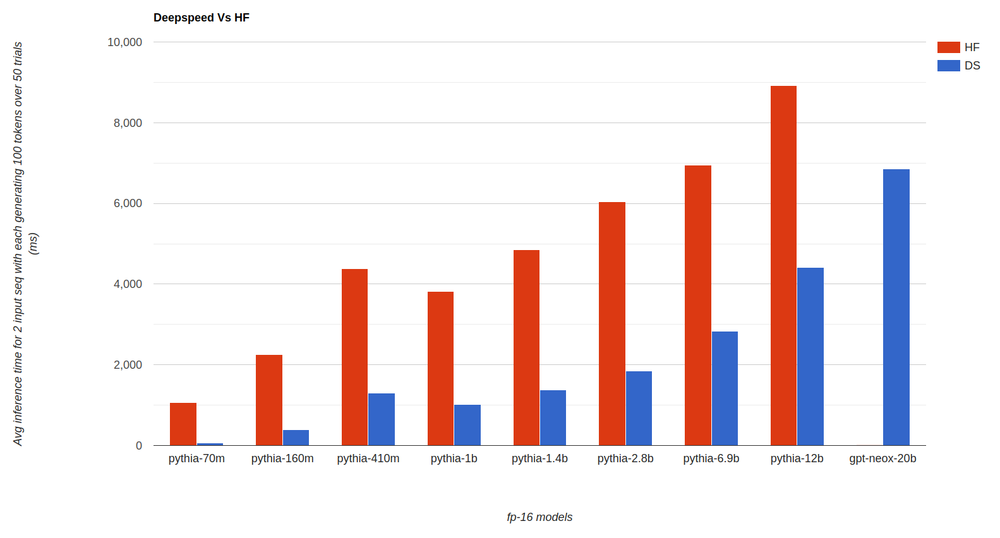

# Neox Inference with Deepspeed

For Inference of neox models we use the Deepspeed MII library. The installation and usage instructions remain same as from [Deepspeed-MII](https://github.com/microsoft/DeepSpeed-MII#getting-started-with-mii).

# Installation
`pip install deepspeed-mii`

# Inference Usage
DeepSpeed MII incorporates both DS inference and Zero inference into one framework. Both of which serve different purposes and cannot be used together.

## 1. DS Inference:
This fits the entire model into GPUs memory and is more suitable for inference applications that are latency sensitive or have small batch sizes.

```
# Deployment
import mii
mii_configs = {"tensor_parallel": 2, "dtype": "fp16", "load_with_sys_mem": True}
mii.deploy(task="text-generation",
           model="EleutherAI/gpt-neox-20b",
           deployment_name="gpt-neox-20b-deploy",
           mii_config=mii_configs)

# Generation
generator = mii.mii_query_handle("gpt-neox-20b-deploy")

# Terminate (if you no longer want to infer)
mii.terminate("gpt-neox-20b-deploy")
```

Neox-20b fp16 model requires greater than 40GB memory and cannot fit on single A100 40GB GPU, so we keep `tensor_parallel:2` to use two GPUs. If you have 80GB GPU, you can set `tensor_parallel:1` for neox-20b to use single GPU.

## 2. Zero Inference:
It adapts and optimises ZeRO-Infinity techniques for model inference on GPUs by hosting the model weights in CPU or NVMe memory, thus hosting no weights (zero) in GPU. It is designed for inference applications that require GPU acceleration but lack sufficient GPU memory to host the model. This therefore have higher latency compared to DS inference.

Example usage:
```
# Deployment
python zero_inference.py

# Generation
generator = mii.mii_query_handle("EleutherAI/pythia-160m_deploy")

# Terminate (if you no longer want to infer)
mii.terminate("EleutherAI/pythia-160m_deploy")
```

# Batch size
Batch size at inference is not directly supported with deepspeed mii. However you can run with few changes and caveats, but note that the higher batch size does not necessarily decrease inference time. Follow the [issue](https://github.com/microsoft/DeepSpeed-MII/issues/133#issuecomment-1509534568) for more details.

# HF Vs DS Inference Comparison


Using benchmark.py, we benchmark different pythia models with neox-20b model to compare HF and Deepspeed inference. All inference are done for fp-16 models using single A100 40GB GPU for pythia models and two A100 40GB GPUs for neox-20b. Relative comparision between HF and Deepspeed is more important than Absolute latency values in the plot.
