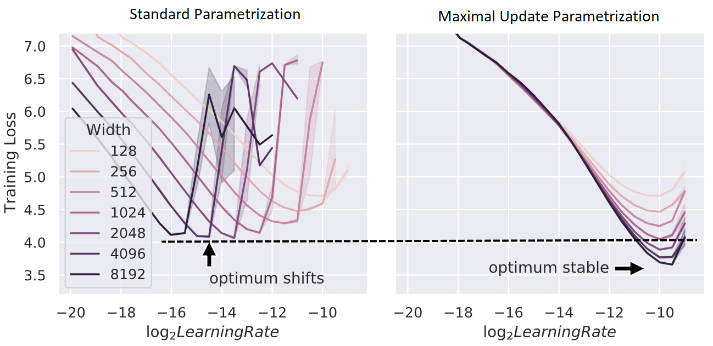
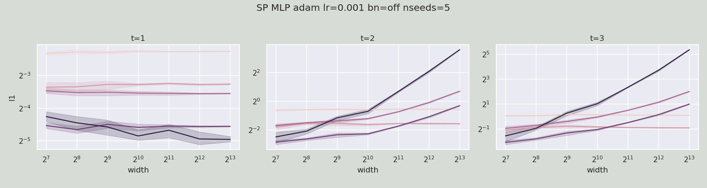
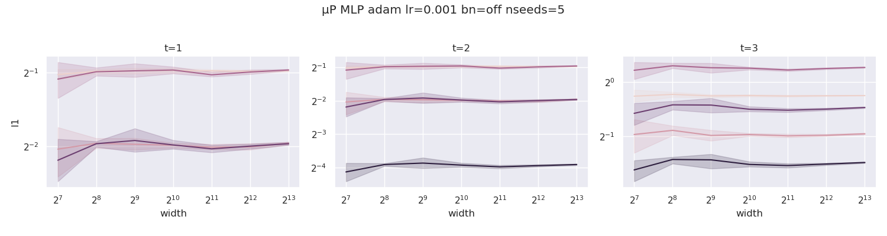
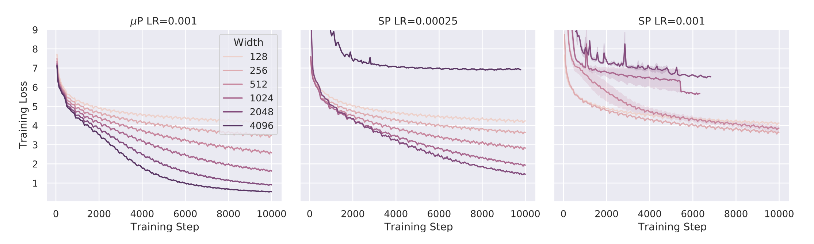

# Maximal Update Parametrization (μP) and Hyperparameter Transfer (μTransfer) 

[Paper link](https://arxiv.org/abs/2203.03466)
|
[Blog link](https://www.microsoft.com/en-us/research/blog/%C2%B5transfer-a-technique-for-hyperparameter-tuning-of-enormous-neural-networks/)

In [*Tensor Programs V: Tuning Large Neural Networks via Zero-Shot Hyperparameter Transfer*](https://arxiv.org/abs/2203.03466), we show that optimal hyperparameters become stable across neural network sizes when we parametrize the model in [maximal update parametrization (μP)](http://arxiv.org/abs/2011.14522).
This can be used to tune extremely large neural networks such as large pretrained transformers, as we have done in our work.
More generally, μP reduces the fragility and uncertainty when transitioning from exploration to scaling up, which are not often talked about explicitly in the deep learning literature.


<font size="1"> *Figure above: Training loss against learning rate on Transformers of varying `d_model` trained with Adam.*</font> 


μP turns out to be the *unique* "natural" parametrization that has this hyperparameter stability property across width, as empirically verified in the gif below on MLPs trained with SGD. Here, across time, we interpolate between PyTorch default and μP's learning rate and initialization scalings (right), and we scale up the width-256 model (log2(width)=8) to width 2^13 = 8192 using this interpolated scaling rule (left).


This repo contains the source code for the `mup` package, our tool that makes the implementation of μP in Pytorch models effortless and less error-prone.

## Table of Contents


  - [Installation](#installation)
    - [Install From Source](#install-from-source)
  - [Basic Usage](#basic-usage)
  - [How `mup` Works Under the Hood](#how-mup-works-under-the-hood)
  - [Current Limitations](#current-limitations)
  - [Checking Correctness of Parametrization](#checking-correctness-of-parametrization)
    - [Coord Check](#coord-check)
    - [Making Your Own Coord Check Plots](#making-your-own-coord-check-plots)
    - [Wider is Always Better](#wider-is-always-better)
  - [Examples](#examples)
  - [Running Tests](#running-tests)
  - [The Basic Math](#the-basic-math)
  - [Contributing](#contributing)
  - [Trademarks](#trademarks)

## Installation

```
pip install mup
```

### Install From Source

Clone this repo, change to its directory, and do
```
pip install -r requirements.txt
pip install -e .
```

## Basic Usage

```Python
from mup import MuReadout, make_base_shapes, set_base_shapes, MuSGD, MuAdam

class MyModel(nn.Module):
    def __init__(self, width, ...):
        ...
        ### In model definition, replace output layer with MuReadout
        # readout = nn.Linear(width, d_out)
        readout = MuReadout(width, d_out)
        ### If tying weights with an input nn.Embedding layer, do
        # readout = MuSharedReadout(input_layer.weight)
        ...
    def forward(self, ...):
        ...
        ### If using a transformer, make sure to use
        ###   1/d instead of 1/sqrt(d) attention scaling
        # attention_scores = query @ key.T / d**0.5
        attention_scores = query @ key.T * 8 / d
        ### We use 8/d instead of 1/d here to be backward compatible
        ###   with 1/d**0.5 when d=64, a common head dimension.
        ...

### Instantiate a base model
base_model = MyModel(width=1)
### Optionally, use `torchdistx.deferred_init.deferred_init` to avoid instantiating the parameters
### Simply install `torchdistx` and use
# base_model = torchdistx.deferred_init.deferred_init(MyModel, width=1)
### Instantiate a "delta" model that differs from the base model
###   in all dimensions ("widths") that one wishes to scale.
### Here it's simple, but e.g., in a Transformer, you may want to scale
###   both nhead and dhead, so the delta model should differ in both.
delta_model = MyModel(width=2) # Optionally use `torchdistx` to avoid instantiating

### Instantiate the target model (the model you actually want to train).
### This should be the same as the base model except 
###   the widths could be potentially different.
### In particular, base_model and model should have the same depth.
model = MyModel(width=100)

### Set base shapes
### When `model` has same parameter shapes as `base_model`,
###   `model` behaves exactly the same as `base_model`
###   (which is in PyTorch's default parametrization).
###   This provides backward compatibility at this particular model size.
###   Otherwise, `model`'s init and LR are scaled by μP.
### IMPORTANT: this should be called as soon as possible,
###   before re-initialization and optimizer definition.
set_base_shapes(model, base_model, delta=delta_model)

### Alternatively, one can save the base model shapes in a file
# make_base_shapes(base_model, delta_model, filename)
### and later set base shapes directly from the filename
# set_base_shapes(model, filename)
### This is useful when one cannot fit both 
###   base_model and model in memory at the same time

### Replace your custom init, if any
for param in model.parameters():
    ### If initializing manually with fixed std or bounds,
    ### then replace with same function from mup.init
    # torch.nn.init.uniform_(param, -0.1, 0.1)
    mup.init.uniform_(param, -0.1, 0.1)
    ### Likewise, if using
    ###   `xavier_uniform_, xavier_normal_, kaiming_uniform_, kaiming_normal_`
    ### from `torch.nn.init`, replace with the same functions from `mup.init`

### Use the optimizers from `mup.optim` instead of `torch.optim`
# optimizer = torch.optim.SGD(model.parameters(), lr=0.1)
optimizer = MuSGD(model.parameters(), lr=0.1)

### Then just train normally
```

Note the base and delta models *do not need to be trained* --- we are only extracting parameter shape information from them.
Therefore, optionally, we can avoid instantiating these potentially large models by using the `deferred_init` function in `torchdistx`.
After installing [`torchdistx`](https://github.com/pytorch/torchdistx), use `torchdistx.deferred_init.deferred_init(MyModel, **args)` instead of `MyModel(**args)`. See [this page](https://pytorch.org/torchdistx/latest/deferred_init.html) for more detail.
In the MLP and Transformer examples (not `mutransformers`) we provided, you can activate this feature by passing `--deferred_init`.


## How `mup` Works Under the Hood


By invoking `set_base_shapes(model, ...)`, each parameter tensor `p` of `model` gets a `p.infshape` attribute that stores, for each of its dimensions, the corresponding base dimension and whether that dimension should be considered `infinite` (i.e. will be scaled up/down, e.g., `d_model` of a Transformer) or `finite` (i.e. will be fixed, e.g., vocabulary size).
This information is used in the initializers and optimizers to automatically scale the parameters or learning rates to be compliant with μP.
For example, the Adam learning rate of hidden weights `p` is calculated as  `globalLR / p.infshape.width_mult()`, where `p.infshape.width_mult()` essentially calculates `fan_in / base_fan_in`.


## Current Limitations

- `set_base_shapes(model, ...)` assumes that `model` has just been randomly initialized in the standard way and rescales its parameters using the base shape information so the model is in μP.
- If you want data parallelism, please use `torch.nn.parallel.DistributedDataParallel` instead of `torch.nn.DataParallel`. This is because the latter removes the attributes the `mup` package adds to each parameter tensor of the model. Also, for performance, `pytorch` [recommends the former anyway](https://pytorch.org/docs/stable/notes/cuda.html#cuda-nn-ddp-instead).
- We scale the learning rate according to μP explicitly by creating refined parameter groups from what is passed to the `mup` optimizer and by manipulating the `lr` attribute in those groups. This is compatible with PyTorch's learning rate schedulers. However, if you roll your own, make sure the scheduler sets the learning rate relative to what is currently in the refined parameter groups. The following is an example of what *not* to do and what is OK:
```python
optimizer = mup.MuAdam(model.parameters(), lr=1e-3)
for pg in optimizer.param_groups:
  # what NOT to do: setting learning rate absolutely
  # pg['lr'] = 1e-3 * 2
  # what is an OK alternative: setting it relatively
  pg['lr'] *= 2
```
- By default, any parameter matrix that has 2 "infinite" dimensions (i.e. dimensions that are different from base dimensions) are considered by `mup` to have shape (fan_out, fan_in), i.e., in the forward pass, this matrix multiplies its input on the right. This is the case with all `nn.Linear` weights from pytorch. If you have a custom parameter, say `W`, that violates this convention, you can manually set `W.infshape.main_idx = 0; W.infshape.main = W.infshape[0]` to let `mup` know that its shape corresponds to (fan_in, fan_out). A similar discussion applies if you have a parameter *tensor* with many dimensions but exactly 2 "infinite" dimensions, for which the first is fan_in and the second is fan_out.
- Currently, [`torch.save` does not save the `infshape` objects attached to each parameter tensor](https://github.com/pytorch/pytorch/issues/72129). Before this is fixed, you would have to set base shape manually after loading a model checkpoint like so:
```python
model = torch.load('my/model/path.pt')
# Important: note the flag `rescale_params=False`!
set_base_shapes(model, 'my/base/shape/path.bsh', rescale_params=False)
```
(`set_base_shapes` by default rescales the parameters of `model`, assuming it's freshly initialized by PyTorch, to be consistent with μP.
The `rescale_params=False` flag turns off this behavior.)


## Checking Correctness of Parametrization


### Coord Check

Just like gradient checking is a simple way of verifying the correctness of an autograd implementation, *coordinate checking* is a simple way to verify you have implemented μP correctly: calculate the average size (which we denote in the y-axis below by `l1`) of the coordinates of each activation vector in, and output of, the model, for a few steps of training and a few different widths.
If implemented correctly, then we shall see this `l1` stable over many widths; otherwise, the `l1` can blow up or shrink to 0 with width.
(We are essentially checking desideratum 1 described below.)
(The `l1` calculates `x.abs().mean()` for each activation vector `x` and is just one measure of the "average size" of `x`'s entries; one can also use analogously defined `l2`, `l4`, etc, though they may exhibit greater fluctuation with random seeds.)

For example, in the following, we plot `width` vs `l1` for 2 steps of training, where t=1 means at initialization, before any gradient update.
Each curve corresponds to an (pre-)activation vector of a layer or the output of the network.
The first set of 3 plots shows an MLP in standard parametrization (SP), trained by adam.
We see after 1 step of update, activation/output `l1` are exploding with width.
This means SP is "incorrect."

We now do the same for an MLP in maximal update parametrization (μP) (including using `mup.optim.MuAdam` instead of `torch.optim.Adam`).
In contrast to the above, all curves stay horizontal, indicating that μP is implemented correctly.

We call this way of checking implementation correctness a *coord check*, short for "coordinate check."

### Making Your Own Coord Check Plots
We provide an easy way to implement this check via functions in the `mup.coord_check` module.
The workflow typically looks like the following.

```Python
from mup.coord_check import get_coord_data, plot_coord_data
# construct a dictionary of lazy μP models with differing widths
def lazy_model(width):
    # `set_base_shapes` returns the model
    return lambda: set_base_shapes(MyMuModel(width), 'my/base/shape/path.bsh')
    # Note: any custom initialization with `mup.init` would need to
    # be done inside the lambda as well
models = {64: lazy_model(64), ..., 1024: lazy_model(1024)}
# make a dataloader with small batch size/seq len
#   just for testing
dataloader = ...
# record data from the model activations over a few steps of training
# this returns a pandas dataframe
df = get_coord_data(models, dataloader)
# This saves the coord check plots to filename.
plot_coord_data(df, save_to=filename)
# If you are in jupyter notebook, you can also do
#   `plt.show()`
# to show the plot
```
For example, the `mup.coord_check.example_plot_coord_check` function is implemented this way for toy MLP and CNN models.

If you see the curves blow up or shrink to 0 with width after a few steps of training, then there's a bug in your μP implementation (did you forget to vary some dimension, like `d_ffn`, in the delta model?).
If instead you see the curves converge to the right, then most likely your implementation is correct.
However, there are two typical exceptions to this;
the following can shrink to 0 at initialization in μP (at a 1/sqrt(width) rate):
  - the network output
  - the attention logits in a Transformer

These are transient, and after a few steps their curves should be roughly flat.
Nevertheless, to remove the discrepancy at init, we recommend
   - initializing the output layer 
   (should be a `MuReadout` instance) weights to be 0 via
   the `readout_zero_init=True` option and
   - initializing the query matrix in a Transformer to 0
     (this has to be done manually). If symmetry-breaking is desired in the attention logits at init, initialize the (relative) position biases with nonzero variance.
     
#### Tips for Coord Check

- Use a large learning rate (larger than you'd use for actual training). This would emphasize any potential exploding coordinates issue, which could be hidden by the initialization if the learning rate is too small.
- If you reuse a module multiple times in the forward pass, then `mup.get_coord_data` will only record the statistics from the last usage. In this case, for testing purposes, one can wrap different usages with `nn.Identity` modules of different names to distinguish them.

### Wider is Always Better



Another sign that μP has not been implemented correctly is if going wider does worse (on training loss) after some width, at some point during training.
The figure above illustrates this in a collection of training curves: (left) the correct implementation should always see performance improve with width, at any point in training; (middle) if you used standard parametrization (SP), sometimes you may see performance improve with width up to some point and then suddenly it becomes worse with wider models; (right) or you may immediately see worsening performance even for narrow models.

## Examples
See the `MLP`, `Transformer`, and `ResNet` folders inside `examples/` as well as the tests in `mup/test` for examples.
People familiar with [Huggingface Transformers](https://github.com/huggingface/transformers) may also find the `examples/mutransformers` submodule instructive (obtained via `git submodule update --init`), which is also available standalone at [https://github.com/microsoft/mutransformers](https://github.com/microsoft/mutransformers).

## Native Integration With Huggingface

Frustrated that your [Huggingface Transformer](https://github.com/huggingface/transformers) breaks when you scale up? Want to tune hyperparameters for your large mult-GPU [Huggingface Transformer](https://github.com/huggingface/transformers) on a single GPU, right out the box? If so, please upvote [this github issue](https://github.com/huggingface/transformers/issues/16157)!


## Running Tests
To run tests, do
```bash
python -m mup.test
```


## The Basic Math

μP is designed so as to satisfy the following desiderata:

> At any time during training
> 1. Every (pre)activation vector in a network should have Θ(1)-sized coordinates
> 2. Neural network output should be O(1).
> 3. All parameters should be updated as much as possible (in terms of scaling in width) without leading to divergence

It turns out these desiderata uniquely single out μP.
To derive μP from them, one needs to carefully consider how the *coordinate size* of a vector Av, resulting from a square matrix A multiplying vector v, depends on those of A and v, when A and v are "correlated".
Here you can think of A as weights and v as an activation vector.
This in turn depends on what kind of matrix is A and what kind of vector is v.
In the context of training a wide neural network, it turns out we only need to consider vectors that has approximately iid coordinates, and two kinds of matrices: 1) those that look like outer products of such vectors, and 2) random iid matrices.
Those of type 1 cover things like weight gradients; those of type 2 cover things like weight initialization.
Then, if A and v both have entry size Θ(1) and they are correlated in ways that arise naturally during training, then we have the following table.

|                  | outer product A (type 1) | iid A  (type 2)    |
|------------------|--------------------------|--------------------|
| Entry size of Av | Θ(n)                     | Θ(sqrt(n))         |

Given this table, one can then trace the forward and backward computation of a network to derive μP straightforwardly.

See [our blog post](https://www.microsoft.com/en-us/research/blog/%C2%B5transfer-a-technique-for-hyperparameter-tuning-of-enormous-neural-networks/) for a gentle primer and [our paper](https://arxiv.org/abs/2203.03466) for details.


## Contributing

This project welcomes contributions and suggestions.  Most contributions require you to agree to a
Contributor License Agreement (CLA) declaring that you have the right to, and actually do, grant us
the rights to use your contribution. For details, visit https://cla.opensource.microsoft.com.

When you submit a pull request, a CLA bot will automatically determine whether you need to provide
a CLA and decorate the PR appropriately (e.g., status check, comment). Simply follow the instructions
provided by the bot. You will only need to do this once across all repos using our CLA.

This project has adopted the [Microsoft Open Source Code of Conduct](https://opensource.microsoft.com/codeofconduct/).
For more information see the [Code of Conduct FAQ](https://opensource.microsoft.com/codeofconduct/faq/) or
contact [opencode@microsoft.com](mailto:opencode@microsoft.com) with any additional questions or comments.

## Trademarks

This project may contain trademarks or logos for projects, products, or services. Authorized use of Microsoft 
trademarks or logos is subject to and must follow 
[Microsoft's Trademark & Brand Guidelines](https://www.microsoft.com/en-us/legal/intellectualproperty/trademarks/usage/general).
Use of Microsoft trademarks or logos in modified versions of this project must not cause confusion or imply Microsoft sponsorship.
Any use of third-party trademarks or logos are subject to those third-party's policies.
