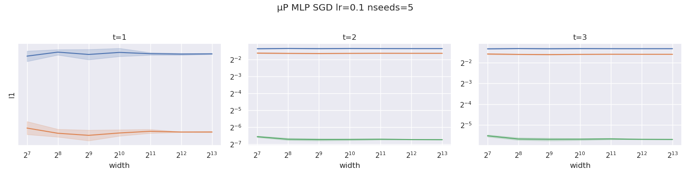
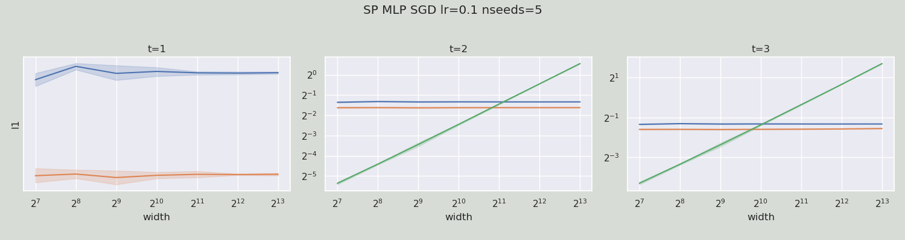

# μP MLP
This folder contains the source code for our experiment on MLP, which also serves as an example usage of `mup`.
The script trains a series of MLPs with increasing hidden sizes from 64 to 8192.

## Save Model Base Shapes
To train a μP model, one needs to first specify the base shapes. To save base shapes info of the narrowest model, run,
```
python main.py --save_base_shapes width64.bsh
```

## Verify Implementation with Coordinate Check
Before we scale up and start training, it is recommended to check the size of activation coordinates as model width increases. We have integrated such a test in this example using the helper functions in `mup`; you can simply run:

```bash
python main.py --load_base_shapes width64.bsh --coord_check
```
You should find the generated plots under `./coord_checks`, which show stable coordinate sizes under μP, e.g., 



and growing sizes under SP, e.g.,




## Start Training
Having verified our implementation of μP, we can scale up our model and train using the same hyperparameters used for the small model and expect that the wider model performs better on the training data and that the optimal hyperparameters transfer.
```
python main.py --load_base_shapes width64.bsh
```

Note that if you do not specify `--load_base_shapes`, the script will default to training a SP model.