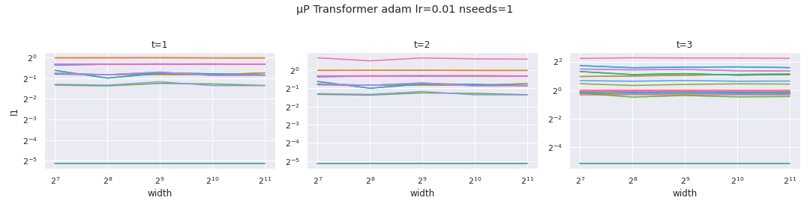
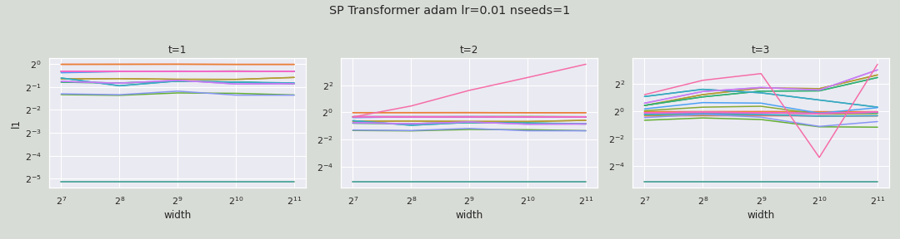

# μP Transformer
This folder contains the source code for our experiment on small Transformers, which also serves as an example usage of `mup`.

## Save Model Base Shapes
To train a μP model, one needs to first specify the base shapes. To save base shapes info, run, for example,
```
python main.py --d_model 256 --save_base_shapes width256.bsh
```

## Verify Implementation with Coordinate Check
Before we scale up and start training, it is recommended to check the size of activation coordinates as model width increases. We have integrated such a test in this example using the helper functions in `mup`; you can simply run:

```bash
# for SGD
python main.py --load_base_shapes width256.bsh --optimizer sgd --lr 0.5 --cuda --coord_check
# for Adam
python main.py --load_base_shapes width256.bsh --optimizer adam --lr 0.01 --cuda --coord_check
```
You should find the generated plots under `./coord_checks`, which show stable coordinate sizes under μP, e.g., 



and growing sizes under SP, e.g.,




## Start Training
Having verified our implementation of μP, we can scale up our model and train using the same hyperparameters used for the small model and expect that the wider model performs better on the training data and that the optimal hyperparameters transfer.
```bash
# for SGD
python main.py --d_model 4096 --load_base_shapes width256.bsh --optimizer musgd --lr 0.5 --cuda
# for Adam
python main.py --d_model 4096 --load_base_shapes width256.bsh --optimizer muadam --lr 0.01 --cuda
```

Note that if you do not specify `--load_base_shapes`, the script will default to training a SP model.
