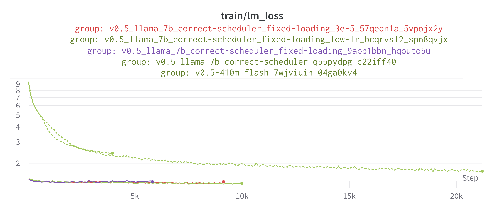
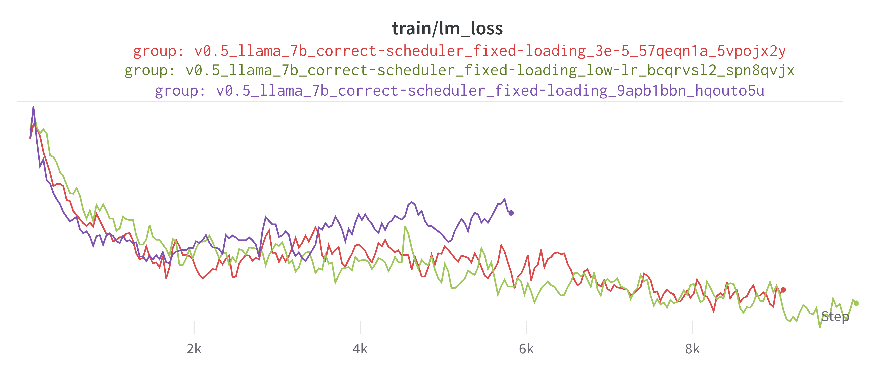

# Development gen. 5 - report 
I started out by training 70M, 410M, and 6.9B models with a Pythia architecture from scratch. This was with the scripts `70m_flash.sh`, `410m_flash.sh`, `6-9b.sh`, and `6-9b_flash.sh`. The analysis of these results aren't particularly important: they were mostly for the purpose of getting the NeoX library up and running. 

Here is a graph of the training loss of the important runs

(width=500)

In the runs `llama_7b` and `llama_7b_correct-scheduler` there was a bug that resulted in the pre-trained Llama checkpoint not being loaded. The three runs with much lower loss were fixed to load the checkpoint correctly. The difference betwen `llama_7b` and `llama_7b_correct-scheduler` is that the former was misconfigured in such a way that the learning rate scheduler was ignored and the optimizer used a constant learning rate. 

The following graph contains the training loss of the three runs that loaded the pre-trained weights correctly. A smoothing of 0.5 is applied to make the chart easier to read.

(width=500)

The runs `llama_7b_correct-scheduler_fixed-checkpoint` use a learning rate of `1.2e-4`, which led to the training loss diverging. The subsequent runs `llama_7b_correct-scheduler_fixed-checkpoint` and `llama_7b_correct-scheduler` use learning rates of `1.2e-5` and `3e-5` respectively. Both appear to train stably. 

These last two good runs were cut short by me reaching my disk quota on the BYU cluster (oops). They are restarted in generation 6. 

